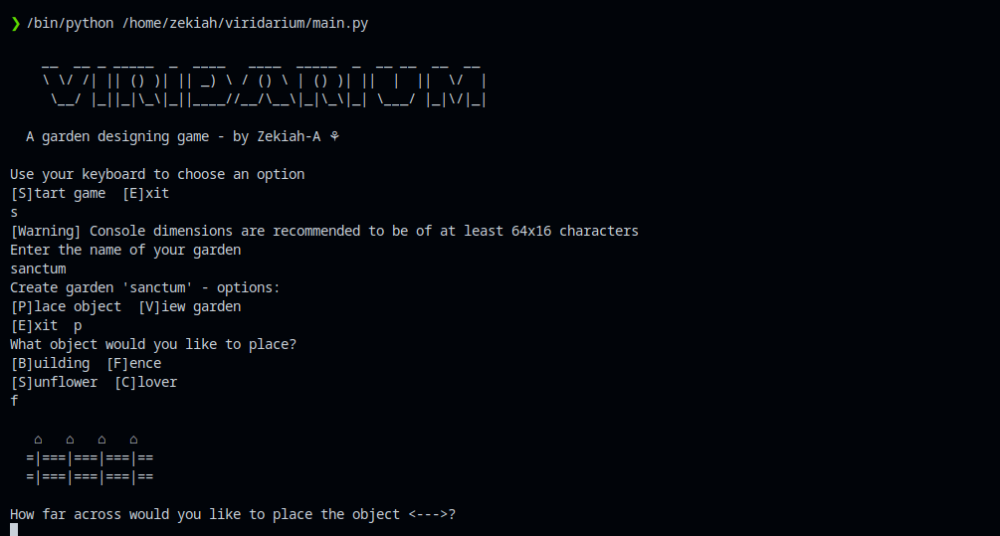

# Viridarium
A toy python game centred around building an ascii garden 

### Running:
The game has been designed to have zero non-standard library dependencies,
to run the game, do the following. 
```sh
    # Clone repository sources
    > git clone https://github.com/Zekiah-A/viridarium.git
    # Enter the game directory
    > cd viridarium
    # Run the game
    > python3 main.py
```

